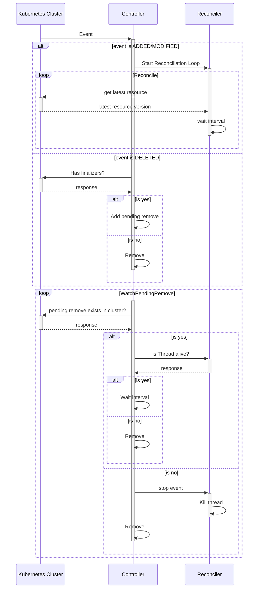

# KUROBOROS

## Operator

The `Operator` adds `Controllers` to watch over them and keeps track of the number of `Threads` that are running. It also runs and watches the webhook server in a Falcon app behind Gunicorn in a separate process.

---

## Controller

A `Controller` is composed of a `GroupVersionInfo` and a `Reconciler` and maybe `ValidationWebhook` and/or `MutationWebhook`. The `GroupVersionInfo` informs the `Controller` about which CRs it should keep track of, adding them as members when an event of `ADDED` or `MODIFIED` is received or removing them when the event is `DELETED`.

Whenever a member is added, the controller creates a `Reconciler` for the CR and starts the reconciliation loop `Thread` that it keeps track of. If a `MODIFIED` event is received while the reconciliation loop is running, the event will be skipped. When the CR is finally removed from the cluster and a `DELETED` event is received, the `Controller` sends a stop event to the `Reconciler` and it returns as soon as possible, ignoring the interval (or backoff) returned (or raised) by the `reconcile` function.

---

### Controller Flow Chart


---

### Controller Sequence Diagram



---

## Group Version Info (`group_version.py`)

The `group_version.py` file located in the `/controllers` path includes the general information about your CRD: its `kind`, `api_version`, and `group`. This file defines the behavior of the controller and the CLI over the CRD. The controller will watch for these values and the CLI will set these values in the manifests.

### Example
```python
from kuroboros.group_version_info import GroupVersionInfo

gvi = GroupVersionInfo(
    api_version="v1",
    group="acme.com",
    kind="Cache",
)
```

---

## Custom Resource Definition (`crd.py`)

The `CRD` is the model of your CRD. This definition will be used to load the etcd data into a Python class and will define the Kubernetes manifest for your CRD. Every `CRD` **must** be a class inherited from `BaseCRD`, otherwise the CLI won't recognize it as a model to generate the manifest.

### CRD Properties

To define a property in the CRD you must use the `prop(type, **kwargs)` function.

Supported types:
- `str`
- `int`
- `float`
- `dict`
- `bool`
- `list[str]`
- `list[int]`
- `list[float]`
- `list[bool]`
- Subclasses of `BaseCRDProp`

Every `prop()` field in the class is a field in the `spec` of the CRD, except for `status`, which by default is `prop(dict, x_kubernetes_preserve_unknown_fields=True)`.

You can create reusable definitions with `BaseCRDProp`.

#### Keyword Arguments

The `prop` function uses two keyword arguments, `properties` and `required`. These arguments define the inner types of a `dict` property and whether it's required. Every other keyword argument passed to the function will be put in the definition of the property itself; only the `x_kubernetes_.*` fields will be transformed to kebab-case.
See the [Official Kubernetes Documentation](https://kubernetes.io/docs/tasks/extend-kubernetes/custom-resources/custom-resource-definitions/#validation) for more info.

#### Classes as properties
The `BaseCRDProp` provides an inheritable class that can be used in the `prop()` function as its type. This is useful so you can access the data as `my_crd.prop.subprop` instead of `my_crd.prop["subprop"]`.

#### Example
```python
# example/controllers/cache/v1/crd.py
from kuroboros.schema import BaseCRD, BaseCRDProp, prop

class CacheResourceObjects(BaseCRDProp):
    cpu = prop(str)
    memory = prop(str)

class CacheResources(BaseCRDProp):
    requests = prop(CacheResourceObjects)
    limits = prop(CacheResourceObjects)

class Cache(BaseCRD):
    image_tag = prop(str, required=True, default="valkey", enum=["valkey", "redis"])
    desired_size = prop(int, required=True, default=3, minimum=1, maximum=20)
    resources = prop(CacheResources)
    status = prop(dict, properties={
        "current_size": prop(int, default=0),
        "phase": prop(str, enum=["Healthy", "Progressing"])
    })
```

---

## Reconciler (`reconciler.py`)

The `Reconciler` is where you implement the method `reconcile`. The `Controller` will create a `Reconciler` for every member to run its loop in a separate `Thread`, so creating in-memory dictionaries and variables in the `BaseReconciler` class as class variables should be done with concurrency in mind. Every `Reconciler` **must** be a class inherited from `BaseReconciler` and be located in `reconciler.py`, otherwise the CLI won't recognize the class.

#### Example

```python
# example/controllers/cache/v1/reconciler.py
from kuroboros.reconciler import BaseReconciler
from controller.cache.v1.crd import Cache
from datetime import timedelta
import threading

class CacheReconciler(BaseReconciler[Cache]):
    def reconcile(self, logger, obj: Cache, stopped: threading.Event):
        if some_condition:
            return timedelta(seconds=5)
        return
```

---

## Admission Webhooks

Currently, only validation and mutation webhooks are supported. Both of these webhooks are optional.

### Validation Webhook (`validation.py`)

Create a class with `BaseValidationWebhook` as its base and implement the methods:
- `validate_create(data)`: method run on a `CREATE` event
- `validate_update(data, old_data)`: method run on `UPDATE` events
- `validate_delete(old_data)`: method run on `DELETE` events

Both the `data` and `old_data` objects are in `read_only` mode, which means that no attribute can be changed and trying to do so will raise an exception.

The CLI will detect this class and use it to create the manifests and the operator will expose the endpoint `POST /<VERSION>/<SINGULAR>/validate`.

#### Example
```python
# example/controllers/cache/v1/validation.py
from kuroboros.webhook import BaseValidationWebhook
from kuroboros.exceptions import ValidationWebhookError

from controllers.cache.v1.crd import Cache

class CacheValidation(BaseValidationWebhook[Cache]):

    register_on = ["CREATE", "UPDATE", "DELETE"]

    def validate_create(self, data: Cache):
        if "some-annotation" not in data.metadata:
            raise ValidationWebhookError("cache must have some-annotation")
        
        return

    def validate_update(self, data: Cache, old_data: Cache):
        # Some update logic
        return        
```

### Mutation Webhook (`mutation.py`)

Using the `BaseMutationWebhook` class, implement the `mutate(data: MyCRD) -> MyCRD` method where you make changes to the existing object in the cluster and return it. Once returned, it will be compared against the original and JSONPatch operations will be performed on it.

Defining this class will expose the endpoint `POST /<VERSION>/<SINGULAR>/mutate` on the webhook server.

#### Example

```python
# example/controllers/cache/v1/mutation.py
from kuroboros.webhook import BaseMutationWebhook

from .crd import Cache

class CacheMutation(BaseMutationWebhook[Cache]):
    def mutate(self, data: Cache):
        data.metadata["annotations"] = {
            **data.metadata["annotations"],
            "some-mandatory-annotation": "something",
            "some-calculated-one": f"something-{rand(1, 100)}"
        }
        return data
```

---

## CLI

The `kuroboros` CLI is the main entrypoint for managing your operator, controllers, and Kubernetes manifests.

### Usage

```sh
kuroboros [OPTIONS] COMMAND [ARGS]
```

**Global Options:**
- `-c, --config TEXT`  Configuration file to use (default: `operator.toml`)

---

### Commands

#### `start`
Starts the operator, loading the config file and all controllers with their versions.

**Options:**
  - `--skip-controllers`     Skips all controllers startup
  - `--skip-webhook-server`  Skips the webhook server startup

**Usage:**
```sh
kuroboros start
```

---

#### `generate`
Generate Kubernetes-related YAMLs.

##### `generate manifests`
Generates all manifests in `./config/base`.

**Usage:**
```sh
kuroboros generate manifests
```

---

##### `generate rbac`
Generates RBAC manifests in `./config/base/rbac`.  
Policies are defined in your config file under `[[generate.rbac.policies]]` sections, e.g.:

```toml
[[generate.rbac.policies]]
api_groups = [""]
resources = ["pods"]
verbs = ["create", "patch", "update", "list", "watch"]
```

**Usage:**
```sh
kuroboros generate rbac
```

---

##### `generate deployment`
Generates deployment-related manifests in `./config/base/deployment`.  
Includes your config file as a ConfigMap with only the `[operator]` section.  
You can set a custom image in the config file:

```toml
[generate.deployment.image]
registry = "my.registry.io"
repository = "cache-operator"
tag = "v0.0.1"
```

**Usage:**
```sh
kuroboros generate deployment
```

---

##### `generate webhooks`
Generates webhook-related manifests in `./config/base/webhooks`.

**Usage:**
```sh
kuroboros generate webhooks
```

---

##### `generate crd`
Generates CRD manifests in `./config/base/crd`.  
Loads every version found in `./controllers` and sets the version in `group_version.py` as the `stored` version.  
Only properties defined with the `prop()` function in your `BaseCRD`-inherited class are included.

**Usage:**
```sh
kuroboros generate crd
```

---

##### `generate overlay [NAME]`
Generates a new Kustomization overlay in `./config/overlays/[NAME]`.

**Usage:**
```sh
kuroboros generate overlay [NAME]
```

---

#### `new`
Create new modules.

##### `new controller`
Creates a new controller in `./controllers`.

**Options:**
- `--kind TEXT`         The kind of the CRD  **[required]**
- `--api-version TEXT`  The version to use (e.g., `v1alpha1`)  **[required]**
- `--group TEXT`        The group owner of the CRD  **[required]**

**Example:**
```sh
kuroboros new controller --kind Cache --api-version v1alpha1 --group acme.com
```

---
##### `new webhook`
Creates a new webhook in `./controllers/<api-version>`.

**Options:**
- `--kind TEXT`         The kind of the CRD  **[required]**
  `--api-version TEXT`  The version to use (example: v1alpha1)  **[required]**
  `--type TEXT`         The type of webhook to create (validation, mutation) **[required]**

**Example:**
```sh
kuroboros new webhook --kind Cache --api-version v1alpha1 --type validation
```

---

##### `new operator [NAME]`
Creates the necessary files for a new operator project.

**Usage:**
```sh
kuroboros new operator [NAME]
```

---

#### `build`
Builds the operator image using Docker.  
Uses the `[generate.deployment.image]` config to tag the image.

**Options:**
- `--build-arg TEXT` Build arguments to pass to Docker **(format: key=val)**. Can be specified multiple times.

**Usage:**
```sh
kuroboros build --build-arg [key=val] --build-arg [key2=arg2]
```

---

#### `deploy OVERLAY`
Applies the given overlay to your current kubeconfig context.

**Usage:**
```sh
kuroboros deploy OVERLAY
```

---

## Metrics

The operator starts collecting and exposing metrics of the threads that it's running. These metrics are exposed by default at port `8080` and collected every 5 seconds. Both of these configurations can be changed in the config file:

```toml
[operator.metrics]
interval_seconds = 5
port = 8080
```

---

## Config

As the deployment only includes the `[operator]` section of the config, if you wish to add an operator-level config you are encouraged to use this file. Otherwise, you can use environment variables or any other method you prefer.

```toml
[operator]
name = "kuroboros-operator"
leader_acquire_interval_seconds = 10
pending_remove_interval_seconds = 5
metrics_update_interval_seconds = 5
retry_backoff_seconds = 5
metrics_port = 8080

[operator.webhook_server]
port = 443
cert_path = "/etc/tls/tls.crt"
key_path = "/etc/tls/tls.key"

[operator.metrics]
interval_seconds = 9
port = 8080

[generate.deployment.image]
registry = ""
repository = "kuroboros-operator"
tag = "latest"

[[generate.rbac.policies]]
api_groups = [""]
resources = ["pods"]
verbs = ["create", "patch", "update", "list", "watch"]
```