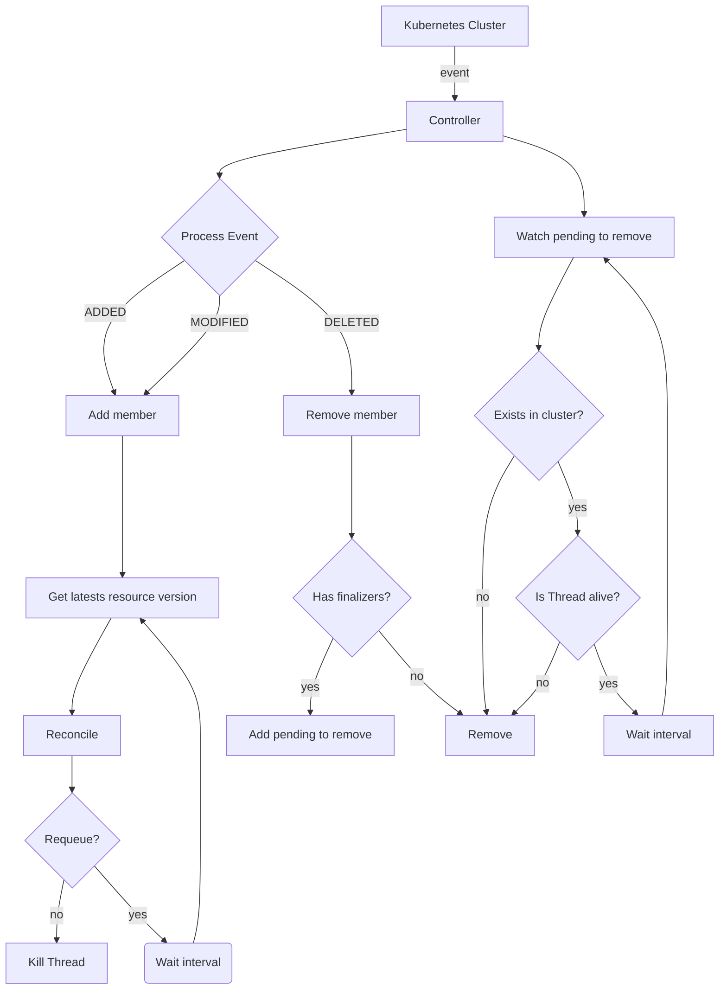

# KUROBOROS
## TODO
 - more unit testing
    - controller
    - operator
    - cli
 - webhooks

## Quickstart

## Operator
The `Operator` add `Controllers` to watch over them and keep track of the number of `Threads` that they are running.
## Controller
A `Controller` is composes of a `GroupVersionInfo` and a `Reconciler`. The `GroupVersionInfo` inform the `Controller` about wich CRs it should keep track, adding them as members when an event of `ADDED` or `MODIFIED` is received or removing them when the event is `REMOVED`.
Whenever a member is added, the controller starts the `reeconcile` function of the `Reconciller` in a loop as a `Thread` that it keeps track, if a `MODIFIED` event is received while the reconciliation loop is runing, the event will be skipped. When the CR is finally removed from the cluster and a `REMOVED` event is recevied, the `Controller` sends a stop event to the `Thread` and it returns as soon as posible, ignoring the interval (or backoff) returned (or rised) by the `reconcile` function.


### Controller Flow Chart

### Controller Sequence Diagram

## Group Version Info
The `group_version.py` file located in the `/controllers` path, includes the general information about your CRD, it contains its `kind`, `api_version` and the `group`. This file defines the behavior of the controller and the CLI over the CRD. The controller will watch for these values and the CLI will set this values in the manifests.

## Custom Resource Definition
The `CRD` is the mopdel of your CRD, this definition will be used to load the etcd data into a python class and will define the kubernetes manifest for your CRD. Every `CRD` *MUST* be a class inherited from `BaseCRD`, otherwhise the CLI wont recognice it as model to generate the manifest.

### CRD Properties
To define a propertie in the CRD you must use the `prop(type, **kwargs)` function.
The supported types are:
- `str`
- `int`
- `float`
- `dict`
- `bool`
- `list[str]`
- `list[int]`
- `list[float]`
- `list[bool]`

Every `prop()` field in the class is a field in the `spec` of the CRD, the only exception to this is the `status` that by default its `prop(dict, x_kubernetes_preserve_unknown_fields=True)`.

#### Keyword Arguments
the `prop` function uses 2 keyword arguments, `properties` and `required`, this arguments define the inner types of a `dict` propertie and if it\`s required or not. Every other keyword argument passed to the function will be put in the definition of the propertie itself, only the `x_kubernetes_.*` fields will be tranformed to snake-case. You can check more info in the [Official Kubernetes Documentation](https://kubernetes.io/docs/tasks/extend-kubernetes/custom-resources/custom-resource-definitions/#validation)
### Example
```python
# example/controllers/cache/v1/crd.py
from kuroboros.schema import BaseCRD, prop

class Cache(BaseCRD):
    image_tag = prop(str, required=True, default="valkey", enum=["valkey", "redis"])
    desired_size = prop(int, required=True, default=3, minimum=1, maximum=20)
    status = prop(dict, properties={
        "current_size" = prop(int, default=0),
        "phase": prop(str, enum=["Healthy", "Progressing"])
    })

```
## Reconciler
The `Reconciler` is the where you implement the method `reconcile`, this function will be run on a separated `Thread` for every member of the `Controller`, so creating in-memory dictionaries and variables in the `BaseReconciler` class should be done with concurrency in mind. Every `Reconciler` *MUST* be a class inherited from `BaseReconciler` and be located in `reconciler.py`, otherwhise the CLI wont recognice the class.
### example
```python
# example/controllers/cache/v1/reconciler.py
from kuroboros.reconciler import BaseReconciler
from .crd import Cache
from datetime import timedelta
import threading


class CacheReconciler(BaseReconciler[Cache]):
    
    
    def reconcile(self, logger, object: Cache, stopped: threading.Event):
        if some_condition:
            return timedelta(seconds=5)
        
        return
```

## Admission Webhooks
CUrrently only validation and mutation webhooks are supported.


## CLI
### the `kuroboros` base command
Usage: `kuroboros [OPTIONS] COMMAND [ARGS]`
Options: `-c, --config TEXT  Configuration file to use [default: opearator.conf]`
#### Starting the Operator (`start`)
Starts the operator, loading the config file, and the controllers with its versions. 

#### Generating Kubernetes resources (`generate`)
Generate Kubernetes related YAMLs

##### Generate all resources (`manifests`)
Generates all manifests in `./config/base`

Usage: `kuroboros generate manifests`

##### Generate RBAC resources (`rbac`)
Generate RBAC related manifests in `./config/base/rbac`.
This includes the policies defined in your config file with `[generate.rbac.policies.*]` in its section, such as:
```ini
 [generate.rbac.policies.manage_pods]
   api_groups=
   resources=pods
   verbs=create,patch,update,list,watch
```

Usage: `kuroboros generate rbac`
##### Generate the Operator Deployment (`deployment`)
Generate the deployment related manifests in `./config/base/deployment`.
This includes your config file as a `ConfigMap` with the `[operator]` section loaded. Every other section will be ignored of this file.
You can set a custom image with the config file
```ini
 [generate.deployment.image]
    registry=my.registry.io
    repository=cache-operator
    tag=v0.0.1
```

Usage: `kuroboros generate deployment`
##### Generate the Custom Resource Definitions (`crd`)
Generates the CRDs manifests in `./config/base/crd`. 
It will load every version found in `./controllers` path but will set the version on `group_version.py` as the `stored` version. The properties defined are based on the `prop()` function and only these properties of your `BaseCRD` inherited class will be taken into account for the generation.

Usage: `kuroboros generate crd`
##### Generate a Kustomization Overlay (`overlay`)
Generates a new `Kustomization` overlay in `./config/overlays/[NAME]`.

Usage: `kuroboros generate overlay [NAME]`
#### Create new modules (`new`)

##### A new Controller (`controller`)
Creates a new controller in `./controllers`
Options:
```
  --kind TEXT         The kind of the CRD  [required]
  --api-version TEXT  The version to use (example: v1alpha1)  [required]
  --group TEXT        The group owner of the CRD [required]
```
Example: 
```
kuroboros new controller --kind Cache --api-version v1alpha1 --group acme.com
```
##### A new Operator (`operator`)
Creates the necessary files for the project with its name

Usage: `kuroboros new operator [NAME]`
#### Build the Operator image (`build`)
This will use Docker to build the image, this command also uses the `[generate.deployment.image]` config to tag the image.

#### Deploy the operator (`deploy`)
Applies the given overlay to your current kubeconfig context

Usage: `kuroboros deploy OVERLAY`


## Metrics

The operator start collecting and exposing metrics of the threads that its running, this metrics are exposed by default at the port `8080` and collected every 5 seconds, both of this configurations can be changed in the config file with
```ini
[operator]
metrics_update_interval_seconds=5
metrics_port=8080
```

## Config

As the deployment only includes the `[operator]` section of the config, if you wish to add a Operator level config you are encourage to use this file, otherwhise you can use env variables or any other method that you prefer

```ini
[operator]
name=kuroboros-operator
leader_acquire_interval_second=10
pending_remove_interval_seconds=5
metrics_update_interval_seconds=5
retry_backoff_seconds=5
metrics_port=8080
```